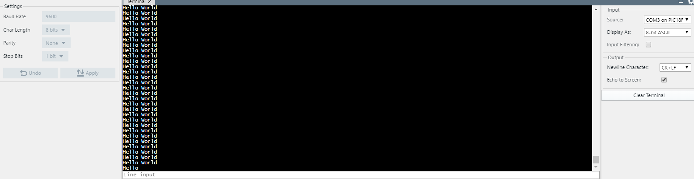

# PIC18F47Q10 EUSART Sending "Hello World" message

This example shows how to send a string message from the PIC18F47Q10 microcontroller to the PC and use MPLAB Data Visualizer Terminal to see it.

## Related Documentation

- [Getting Started with UART using EUSART on PIC18](https://microchip.com/)
- [PIC18F-Q10 Family Product Page](https://www.microchip.com/design-centers/8-bit/pic-mcus/device-selection/pic18f-q10-product-family)

## Software Used

- MPLAB® X IDE 5.30 or newer [(microchip.com/mplab/mplab-x-ide)](http://www.microchip.com/mplab/mplab-x-ide)
- MPLAB® XC8 2.10 or a newer compiler [(microchip.com/mplab/compilers)](http://www.microchip.com/mplab/compilers)
- MPLAB® Code Configurator (MCC) 3.95.0 or newer [(microchip.com/mplab/mplab-code-configurator)](https://www.microchip.com/mplab/mplab-code-configurator)
- MPLAB® Code Configurator (MCC) Device Libraries PIC10 / PIC12 / PIC16 / PIC18 MCUs [(microchip.com/mplab/mplab-code-configurator)](https://www.microchip.com/mplab/mplab-code-configurator)
- Microchip PIC18F-Q Series Device Support (1.4.109) or newer [(packs.download.microchip.com/)](https://packs.download.microchip.com/)

## Hardware Used

- PIC18F47Q10 Curiosity Nano [(DM182029)](https://www.microchip.com/Developmenttools/ProductDetails/DM182029)

## Setup

The PIC18F47Q10 Curiosity Nano Development Board [(DM182029)](https://www.microchip.com/Developmenttools/ProductDetails/DM182029) is used as the test platform. It has an onboard debugger that acts as an USART to USB convertor so no further hardware is needed.

The following configurations must be made for this project:

| Pin | Configuration  |
| :-: | :------------: |
| RD0 | Digital Output |

## Operation

Run the code, start MPLAB® X Data Visualizer on the correct COM port and select the terminal input source than messages will start appearing.

## Summary

In this example the EUSART is set in the most common configuration (asynchronous operation and 8N1 message format) and "Hello World" messages are transmitted. Data Visualizer is used to see the messages on the PC.
